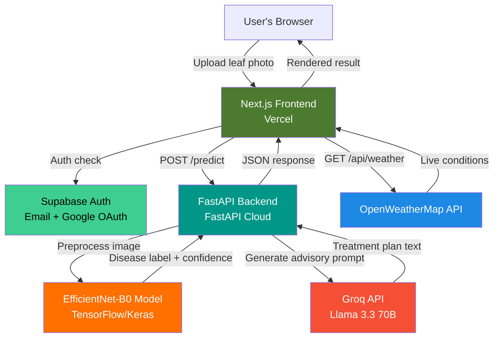
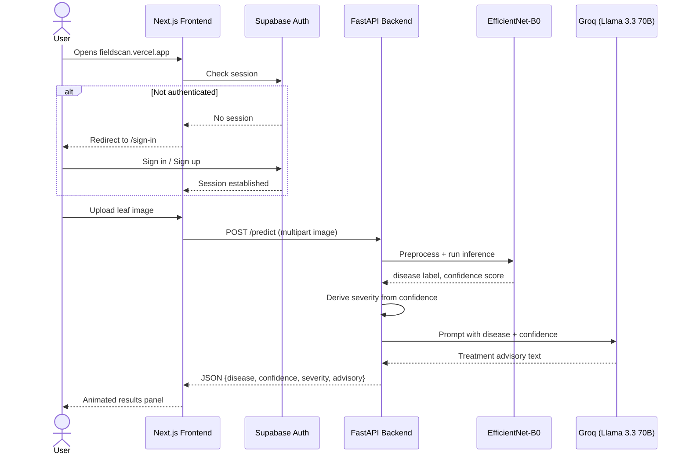

<div align="center">

# 🌿 FieldScan

### Read the leaf before the field tells you.

**An AI-powered crop disease detection and treatment advisory platform** — upload a leaf photo, get an instant diagnosis, and receive a farmer-ready treatment plan generated by a large language model.

[](https://fieldscan.vercel.app)
[](https://fieldscan-backend.fastapicloud.dev)


</div>

---

## 📌 Table of Contents

- [Overview](#-overview)
- [The Problem](#-the-problem)
- [The Solution](#-the-solution)
- [Key Features](#-key-features)
- [Screenshots](#-screenshots)
- [System Architecture](#-system-architecture)
- [Request Flow](#-request-flow)
- [Tech Stack](#-tech-stack)
- [Machine Learning Model](#-machine-learning-model)
- [API Reference](#-api-reference)
- [Project Structure](#-project-structure)
- [Getting Started](#-getting-started)
- [Environment Variables](#-environment-variables)
- [Challenges & Solutions](#-challenges--solutions)
- [Roadmap](#-roadmap)
- [Author](#-author)
- [License](#-license)

---

## 🌾 Overview

**FieldScan** is a full-stack, production-deployed web application that helps farmers and agronomists diagnose crop diseases in seconds. A user uploads a photo of a plant leaf, a convolutional neural network (EfficientNet-B0) classifies the disease, and a large language model (Llama 3.3 70B via Groq) generates a practical, farmer-readable treatment plan — all wrapped in a secure, authenticated web experience with live weather-based risk context.

This project was built end-to-end — model training, backend API, frontend UI/UX, authentication, and cloud deployment — as a flagship portfolio project and capstone submission for **NeuroFive Solutions**.

---

## 🚩 The Problem

Crop diseases destroy an estimated **20–40% of global agricultural yield every year**, and smallholder farmers rarely have same-day access to a plant pathologist. By the time visible symptoms are correctly identified through word-of-mouth or trial-and-error treatment, the disease has often already spread across the field. Existing diagnostic tools are either:

- Too slow (in-person agricultural extension visits)
- Too technical (research-grade plant pathology tools not built for field use)
- Not actionable (identification without a clear treatment plan)

## 💡 The Solution

FieldScan closes that gap with a **three-second, phone-camera diagnosis loop**:

1. **Detect** — A trained CNN identifies the disease from a single leaf photo with a confidence score.
2. **Assess** — The system estimates severity (mild / moderate / severe) from model confidence.
3. **Advise** — An LLM converts the raw diagnosis into a short, actionable treatment plan a farmer can follow immediately — no agronomy degree required.

Weather context (via OpenWeatherMap) is layered in to flag when current humidity and conditions raise disease risk, turning a reactive tool into a proactive one.

---

## ✨ Key Features

| Feature | Description |
|---|---|
| 🔍 **AI Disease Detection** | EfficientNet-B0 CNN classifies leaf images across 15 disease classes with 91.6% validation accuracy |
| 📋 **LLM Treatment Advisory** | Llama 3.3 70B (via Groq) generates a 3–4 sentence, practical treatment plan per diagnosis |
| 📊 **Confidence & Severity Scoring** | Animated gauge + severity meter translate raw model confidence into an interpretable risk level |
| 🌦️ **Live Weather Integration** | Real-time temperature, humidity, and wind data contextualize disease risk for the day |
| 🔐 **Secure Authentication** | Full email/password + Google OAuth flow via Supabase Auth, gating all scan access |
| 📈 **Disease Trend Visualization** | Interactive charts (Recharts) surface detection trends over time |
| 🎬 **Scan-in-Progress Animation** | A live scan-beam / Grad-CAM-style visual overlay during inference for a polished UX |
| 🧾 **Raw Output Inspector** | Full JSON response viewer for transparency and debugging |
| ⚠️ **Graceful Failure Handling** | Every external call (model, LLM, weather) degrades gracefully with a farmer-friendly fallback message instead of crashing |

---

## 🖼️ Screenshots

<!--
HOW TO ADD YOUR SCREENSHOTS (do this in GitHub, not VS Code):
1. Click the pencil "Edit" icon on this README in GitHub.
2. Click right after one of the "[ ... ]" placeholder lines below.
3. Drag your screenshot image file from your computer straight into the text box.
4. GitHub uploads it and inserts a line like: 
5. Delete the "[ ... ]" placeholder text on that line — keep GitHub's inserted image line.
6. Repeat for all 4, then scroll down and click "Commit changes."
-->

**Landing Page**


**Sign In Page**


**Scanning Animation**


**Results Panel**
[ results panel screenshot

 ]

📺 **Demo Video:** _[Add unlisted YouTube link here]_


---

## 🏗️ System Architecture



---

## 🔄 Request Flow



---

## 🧰 Tech Stack

| Layer | Technology |
|---|---|
| **Frontend Framework** | Next.js (App Router), TypeScript |
| **Styling & Animation** | Tailwind CSS, Framer Motion |
| **Data Visualization** | Recharts |
| **Backend Framework** | FastAPI (Python) |
| **ML Framework** | TensorFlow / Keras |
| **ML Architecture** | EfficientNet-B0 (transfer learning) |
| **LLM Advisory Engine** | Groq API — Llama 3.3 70B Versatile (OpenAI-compatible SDK) |
| **Authentication & Database** | Supabase (email/password + Google OAuth) |
| **Weather Data** | OpenWeatherMap API |
| **Backend Hosting** | FastAPI Cloud |
| **Frontend Hosting** | Vercel |
| **Version Control** | Git & GitHub |

---

## 🧠 Machine Learning Model

| Property | Value |
|---|---|
| Base architecture | EfficientNet-B0 |
| Training approach | Transfer learning, fine-tuned on labeled leaf imagery |
| Input size | 224 × 224 × 3 (RGB) |
| Output classes | 15 disease categories (including healthy classes) |
| Validation accuracy | **91.6%** |
| Inference time | ~2 seconds per image |
| Label format | `Crop___Disease_Name` (parsed and humanized at the API layer) |

Severity is derived heuristically from model confidence at inference time:

| Confidence | Severity |
|---|---|
| > 85% | Mild |
| 60% – 85% | Moderate |
| < 60% | Severe |

---

## 📡 API Reference

**Base URL:** `https://fieldscan-backend.fastapicloud.dev`

| Method | Endpoint | Description |
|---|---|---|
| `GET` | `/` | Health check — returns API running status |
| `POST` | `/predict` | Accepts a multipart image file, returns disease classification + treatment advisory |

**`POST /predict` — Sample Response:**

```json
{
  "disease": "Tomato Late Blight",
  "raw_label": "Tomato_Late_blight",
  "confidence": 49.5,
  "severity": "severe",
  "healthy": false,
  "advisory": "To control Tomato Late blight, act immediately by removing and destroying any infected leaves or plants to prevent the disease from spreading. Apply a fungicide, such as copper-based products, to the remaining healthy plants to protect them from infection. Spray the fungicide every 7-10 days for at least 3-4 weeks to ensure the disease is fully under control."
}
```

---

## 📂 Project Structure

```
fieldscan/
├── app/
│   ├── page.tsx              # Main scan interface + auth guard
│   ├── layout.tsx
│   ├── sign-in/
│   │   └── page.tsx           # Auth page (Supabase email + Google OAuth)
│   └── api/
│       └── weather/
│           └── route.ts       # OpenWeatherMap proxy route
├── lib/
│   └── supabaseClient.ts      # Supabase client initialization
├── public/
│   └── hero-field.mp4
│
fieldscan-backend/
├── main.py                    # FastAPI app — /predict, CORS, Groq advisory logic
├── model/
│   ├── fieldscan_model.keras  # Trained EfficientNet-B0 weights
│   └── class_names.json       # Disease label mapping
├── requirements.txt
└── pyproject.toml
```

---

## 🚀 Getting Started

### Prerequisites
- Node.js 18+
- Python 3.11–3.12
- Supabase project (free tier)
- Groq API key
- OpenWeatherMap API key

### Frontend Setup

```bash
git clone https://github.com/ailanasirai/fieldscan.git
cd fieldscan
npm install
npm run dev
```

### Backend Setup

```bash
cd fieldscan-backend
python -m venv venv
.\venv\Scripts\Activate.ps1      # Windows PowerShell
pip install -r requirements.txt
uvicorn main:app --reload
```

The frontend runs at `http://localhost:3000`, the backend at `http://localhost:8000`.

---

## 🔑 Environment Variables

**Frontend (`.env.local`):**

| Variable | Description |
|---|---|
| `NEXT_PUBLIC_SUPABASE_URL` | Supabase project URL |
| `NEXT_PUBLIC_SUPABASE_ANON_KEY` | Supabase public anon key |
| `OPENWEATHER_API_KEY` | OpenWeatherMap API key |

**Backend (`.env`):**

| Variable | Description |
|---|---|
| `GROQ_API_KEY` | Groq API key for LLM advisory generation |

---

## 🧩 Challenges & Solutions

| Challenge | Solution |
|---|---|
| Gemini's free tier returned a hard quota=0 error, blocking advisory generation | Migrated the advisory engine to **Groq (Llama 3.3 70B)** via the OpenAI-compatible SDK, with full timeout/connection/error handling and graceful fallback text |
| Hugging Face Spaces now requires a Pro plan for Docker-based hosting; Render.com required credit card verification | Deployed the backend to **FastAPI Cloud**, which needed neither |
| TensorFlow had no pre-built wheel for the default Python version on the hosting platform, breaking the build | Pinned the Python version explicitly via `pyproject.toml` (`>=3.11,<3.13`) |
| FastAPI Cloud only uploads the directory being deployed from, not parent directories, so the model file wasn't found at runtime | Restructured the repo to move the `model/` folder inside `fieldscan-backend/` and updated all model-loading paths accordingly |
| A wildcard CORS origin (`https://*.vercel.app`) silently failed in production, blocking every request from the live frontend with a CORS error | Replaced it with an explicit production domain plus a proper `allow_origin_regex` for preview deployments |
| Supabase's free tier auto-pauses the database after inactivity, risking downtime during review | Documented a manual dashboard check before any submission/demo window |
| Any unauthenticated user could access the scan feature directly, bypassing login entirely | Added a Supabase session check at the top of the main page component, redirecting unauthenticated users to `/sign-in` before any scan UI renders |

---

## 🗺️ Roadmap

- [ ] Persist scan history per user in Supabase (currently UI-only)
- [ ] Grad-CAM heatmap overlay on the actual uploaded image (not just a decorative scan animation)
- [ ] 7-day disease spread forecasting using historical weather + detection data
- [ ] Multi-language treatment advisories (Urdu, Punjabi)
- [ ] Mobile-first PWA support for offline field use

---

## 👩‍💻 Author

**Aila Nasir**
AI/ML Researcher — Healthcare & Agricultural AI, Computer Vision, Agentic Workflows

- GitHub: [@ailanasirai](https://github.com/ailanasirai)

---

## 📄 License

This project is submitted as a capstone project for NeuroFive Solutions. All rights reserved unless otherwise licensed by the author.

---

<div align="center">

**Built with 🌱 by Aila Nasir**

</div>
